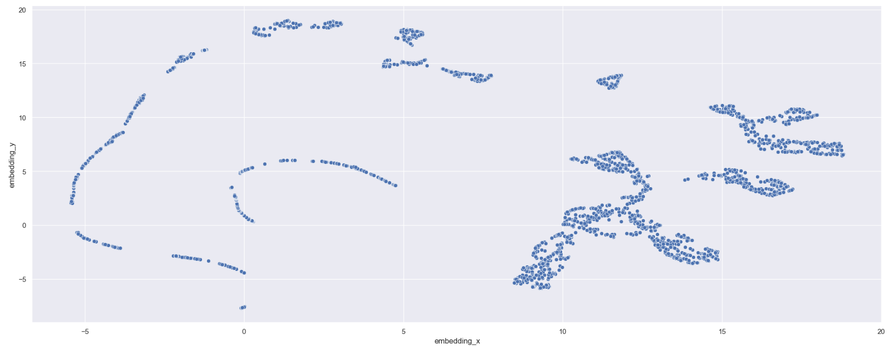

# Insiders Clustering

## Este projeto tem como objetivo descobrir pessoas semelhantes para participar de um programa de fidelidade

# 1. Business Problem.

A empresa All in One Place é uma empresa de outlet multimarcas, ou seja, comercializa produtos de segunda linha de várias marcas a um preço menor através de um e-commerce. 

Ao analisar a base de clientes o time de marketing constatou a existência de alguns clientes que compram produtos mais caros e com alta frequência contribuindo com uma parcela significativa do faturamento. Baseado nessa percepção, o time de marketing vai lançar um programa de fidelidade para os melhores clientes da base. chamado insiders. Mas o time não tem conhecimento avançado em análise de dados para eleger os participantes do programa.

Por esse motivo, o time de marketing requisitou ao time de dados uma seleção de clientes elegiveis ao programa, usando técnicas avançadas de manipulação de dados.

# 2. Premissas de negócio.

1. No conjunto de características utilizadas para agrupar os grupos de clientes deverá conter pelo menos a receita e frequencia de compra.
2. O resultado deverá ser entregue em uma apresentação com as dúvidas de negócio.
3. Deverá ser entregue um dashboard em looker para acompanhamento dos clientes insiders e demais grupos para que seja possível realizar o acompanhamento.

# 3. Objetivo.

1. Deve ser entregue a lista de clientes que serão elegíveis ao grupo de insiders.
2. Responder o conjunto das perguntas de negócio sobre o grupo insiders.
3. A descrição do grupo, a lista de clientes e as respostas das questões de negócio deverão ser entregues em uma apresentação e deverá ser criado um dashboard para acompanhamento do grupo.

# 3. Planejamento da solução.

**Step 01. Descrição dos dados:**

  - Ajustar o nome das colunas.
  - Checar os tipos de dados e verificar a necessidade de alteração.
  - Checar os NA e realizar e o replace caso necessário.
  - Relizar a descrição estatisticas dos dados númericos e avaliar distorções.

**Step 02. Filtragem de Variáveis:**
 
  - Filtrar todas as colunas e dados que não irão contribuir para construção do projeto ou que sofre algum restrição de atualização. Seguindo as premissas anteriores foram filtrados os seguintes dados:
    
    1. Coluna unit_price para valores maiores ou iguais a 0.04 para evitar a entrada de dados negativos que podem ser realacionados a descontos.
    2. Na coluna stock_code foram retirados os códigos 'POST', 'D', 'DOT', 'M', 'S', 'AMAZONFEE', 'm', 'DCGSSBOY', 'DCGSSGIRL', 'PADS', 'B' e 'CRUK' que podem conter diversas características não relacionados a venda.
    3. Foi excluído a coluna description por não ter uma relevancia para a construção do modelo.
    4. Foram retirados os itens 'European Community' e 'Unspecified' da coluna country por não terem um divisão adequada do país ou por não terem uma descrição clara.
    5. Foi retirado o código 16446 da coluna 'customer_id' por apresentar um valor muito distoante dos demais.
    6. A base foi dividida em duas sendo uma chamada de returns ( base de devolução com valores negativos) e purchases (representa a base de vendas)

**Step 03. Feature Engineering:**

  - O processo de feature engineering visa a criação de features a partir da combinação de features ou da mudança de formatos. Essas novas features podem ajudar a melhorar o resultado do modelo criando uma maior variabilidade dos dados. Segue o conjunto de features criadas:

    1. Gross Revenue: Faturamento por cliente
    2. Recency : Tem entra última compra.
    3. Quantity of purchased: Quantidade de compra
    4. Quantity total of items purchased: Quantidade total de itens por compra
    5. Quantity of products purchased: Quantidade de tipos diferentes de itens comprados.
    6. Average Ticket Value: Valor médio por compra.
    7. Average Recency Days: Tempo médio das recências
    8. Frequency Purchase: Frequencia de compra.
    9. Number of Returns: Quantidade de devoluções
    10. Basket Size: Tamanho da cesta.
    11. Unique Basket Size: Quantidade de produtos distintos por cesta.
 

**Step 04. Exploração dos dados e analise dos espaços:**

    - Nesta etapa foram realizados a avaliação univariada utilizando o pandas profile para avaliar as metricas de tendencias central e de dispersão. Além disso, foi avaliado a distribuição dos dados de cada features para avaliar o formato da curtose, assimetria e exitencia de outlier.
    - Além da univariada, foi realizado a analise bivariada visando encontrar alguma alta correlação que pode reduzir a perfomance do modelo.

**Step 05. Estudo do espaço:**

Nessa etapa foi avaliado a distribuição dos dados em menor dimensionaldiade. Para reduzir a dimensionalidade usamos o PCA, UMAP, TSNE e Baseado em Embedding.

No espaço dos componentes principais gerado pelo PCA a distribuição do dados não apresentou uma separabilidade, conforme figura abaixo:

    

No espaço gerado pelo UMAP a distribuição teve uma evolução se comprado ao PCA, porém, ainda apresenta uma concentração em determinadas regiões, conforme figura abaixo:

No espaço gerado pelo TSNE a distrbuição teve uma maior separabilidade se comparado ao PCA, porém ainda apresenta baixa separabilidade dos dados.

O espaço gerado Random Forest (Embedding) apresentou a melhor distribuição dos dados com a formação de clusters mais evidentes.

**Step 06. Hyperparameter Fine-Tunning e teste dos modelos:**
    
Nesta etapa foi realizar o teste com os modelos e ajuste dos parametros com os modelos K-Means, GMM, Hierarchical Clustering e DBSCAN. Os resultados obtidos foram:

Foi tomado a decisão de escolher o número de 8 clusters para facilitar o direcionamento das ações de marketing. Além disso, o modelo selecionado foi o Hierarchical Clustering por apresentar a melhor perfomance para o número de clusters escolhido.

**Step 08. Analise do clusters:**

   - Ao definir os clusters obtivemos as seguintes descrições:

  ### Cluster 01:  ( Candidato à Insider )
    - Número de customers: 468
    - Faturamento médio: 8836
    - Recência média: 21 dias
    - Média de Produtos comprados: 424 produtos
    - Frequência de compra: 0.09 quant. de compras/dia
    - Receita em média: $8836.13,00 dólares
        
  ### Cluster 03: 
    - Número de customers: 502
    - Faturamento médio: 2620.966992
    - Recência média: 41 dias
    - Média de Produtos comprados: 141 produtos
    - Frequência de compra: 0.04 quant. de compras/dia
    - Receita em média: $2620.96 dólares
        
   ### Cluster 08: 
    - Número de customers: 308
    - Faturamento médio: 2467,04
    - Recência média: 74 dias
    - Média de Produtos comprados: 59 produtos
    - Frequência de compra: 0.11 quant. de compras/dia
    - Receita em média: $2467,04 dólares
   
   ### Cluster 02: 
    - Número de customers: 404
    - Faturamento médio: 1689.18
    - Recência média: 54 dias
    - Média de Produtos comprados: 89 produtos
    - Frequência de compra: 0.05 quant. de compras/dia
    - Receita em média: $1689.18,00 dólares
   
   ### Cluster 06: 
    - Número de customers: 372
    - Faturamento médio: 1237.75
    - Recência média: 61 dias
    - Média de Produtos comprados: 54 produtos
    - Frequência de compra: 0.04 quant. de compras/dia
    - Receita em média: $1237.75,00 dólares
   
   ### Cluster 07: 
    - Número de customers: 322
    - Faturamento médio: 971.02
    - Recência média: 75 dias
    - Média de Produtos comprados: 37 produtos
    - Frequência de compra: 0.07 quant. de compras/dia
    - Receita em média: $971.02,00 dólares    
  
   ### Cluster 05: 
    - Número de customers: 278
    - Faturamento médio: 583.41
    - Recência média: 91 dias
    - Média de Produtos comprados: 11 produtos
    - Frequência de compra: 0.02 quant. de compras/dia
    - Receita em média: $583.41,00 dólares    

   ### Cluster 04: 
    - Número de customers: 314
    - Faturamento médio: 527.52
    - Recência média: 136 dias
    - Média de Produtos comprados: 16 produtos
    - Frequência de compra: 0.52 quant. de compras/dia
    - Receita em média: $527.52,00 dólares      

**Step 09. Top 3 Data Insights:**

H1: Os clientes do cluster insiders possuem um volume (produtos) de compras acima de 10% do total de compras.

Verdade: O cluster insider possuem um volume de compra de produtos de 54.48%.

H2: Os clientes do cluster insiders possuem um volume (faturamento) de compras acima de 10% do total de compras

Verdadeiro: O cluster insider possuem um volume de GMV de 51.73%

H3: Os clientes do cluster insiders tem um número de devolução médio abaixo da média da base total de clientes

Falso: O cluser insiders tem a média de devoluções acima da média geral

**Step 09. Questões de negócio :**

1. Quem são as pessoas elegíveis para participar do programa de Insiders ?

Respostas: Cerca de 468

2. Quantos clientes farão parte do grupo?

Respostas: Cerca de 468

3. Quais as principais características desses clientes ?
Respostas: As características são:

- Número de customers: 468 (16% do customers )
- Faturamento médio: 8836
- Recência média: 21 dias
- Média de Produtos comprados: 424 produtos
- Frequência de Produtos comprados: 0.09 produtos/dia
- Receita em média: $8836.13,00 dólares

4. Qual a porcentagem de contribuição do faturamento, vinda do Insiders ?

Respostas: O cluster Insiders corresponde a 51,72% do faturmento.

5. Quais as condições para uma pessoa ser elegível ao Insiders ?

Respostas: Os critérios básicos para um cliente ser considerado Insider é possuir um gasto médio de igual ou superior a $8836, recência não superior a 21 dias e frequencia média de 0.09 de compras por dia.

6. Quais as condições para uma pessoa ser removida do Insiders ?

Respostas: O cliente será retirado do grupo insiders caso não atenda a dois ou mais requisitos exigidos para ser do grupo insiders por mais de 60 dias consecutivos ou reduza o valor médio de gastos para patamares inferiores a $8.835 por 3 meses consecutivos.

8. Quais ações o time de marketing pode realizar para aumentar o faturamento?

Respostas:

 1. Receita / Ticket Médio (aumentar o valor gasto por compra):

     - Cross-sell e upsell inteligentes: sugerir itens complementares ou de categoria superior no carrinho.

     - Bundles promocionais: descontos em combos de produtos ou kits de marcas parceiras.

     - Frete grátis acima de determinado valor: estimular aumento do carrinho médio.

     - Criação de grupos intermediários ao grupo Insiders: Criar grupos intermediários com ofertas e serviços VIP que aumentam a cada elevação de grupo.

 2. Frequência (aumentar o número de compras por cliente):

     - Programa de fidelidade com benefícios progressivos: pontos, cashback ou acesso antecipado a promoções.

     - Assinaturas de produtos recorrentes (ex.: básicos de vestuário, perfumes, acessórios).

     - Campanhas de “compre e ganhe”: recompensas por volume ou frequência de compras.

     - Ações de gamificação: desafios mensais (“compre 3 vezes e ganhe um brinde”).

     - Segmentação por comportamento: recomendações automáticas com base em histórico de navegação e categorias preferidas.
 
 3. Recência (diminuir o tempo entre a última e a próxima compra):

     - Campanhas de reativação segmentadas: e-mails e SMS com ofertas exclusivas para clientes inativos há 30, 60 e 90 dias.

     - Retargeting personalizado: anúncios dinâmicos exibindo produtos visualizados recentemente ou similares.

     - Push notifications de novidades: destacar novas coleções ou lançamentos das marcas favoritas.

     - Cupons de “boas-vindas de volta”: incentivo com prazo curto para recompra.

     - Fluxo automatizado de remarketing pós-compra: enviar lembrete de produtos complementares após um período determinado.

**Step 10. Deploy Modelo to Production:**

# 8. Conclusions

  Os algoritmos de clusterização são ferramentas extremamente úteis para entender o comportamento do cliente e na resolução de problemas de negócio que necessitem de agrupamentos se rotulos pré-definidos. Neste projeto a utilização dos algoritmos ajudaram a definir um grupo de clientes para criação do programa de fidelização e, além disso, contribuição para a criação de um grupo de referência para nortear as ações de marketing visando aumentar o desempenho da empresa transformando os demais grupos em insiders.

# 9. Next Steps to Improve

  - Realizar o estudo da cesta de compras do grupo insiders para subsidear as ações de marketing para outros grupos com o objetivo de aproxima-los do padrão mais elevado.
  - Efetuar a projeção de faturamento do grupo insiders para avaliar a viabilidade das ações de marketing.

